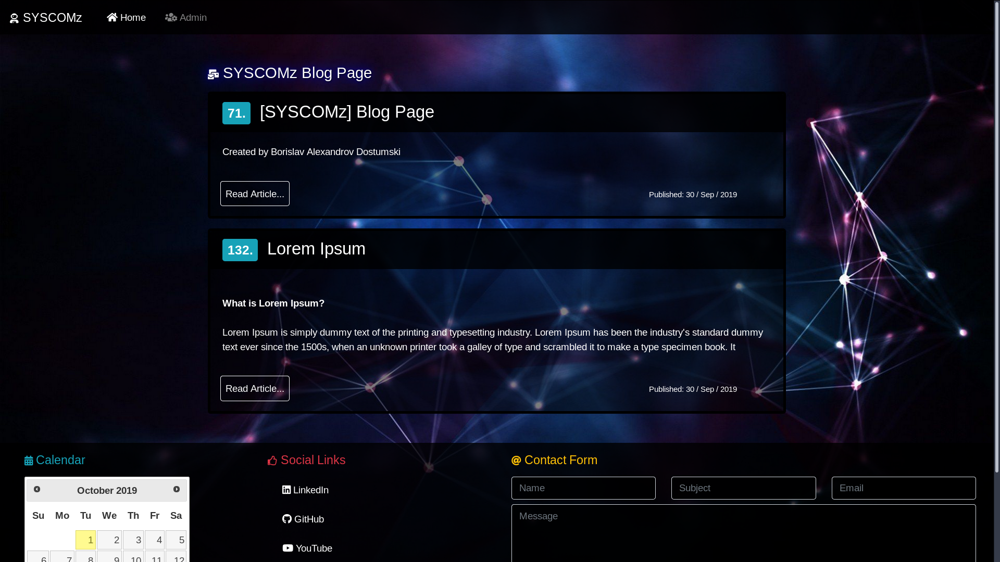

# sipleBLOG by [SYSCOMz]
BLOG WEBSITE
--------------

## **simpleBLOG** is a:
* Blog website

  

<a href="https://www.youtube.com/watch?v=YKbuZ7UPjUs&t=14s">simpleBLOG VIDEO</a>

## Requirements
* **To work with the program you need to start it in a web server**
* **To login from main menu click Admin link [ Username = root ] && [ Password = root ]**

## Setup
* **You need to import [ syscomz_blog.sql ] file to your SQL Database**
* **If you want to change login [ Username && Password ], do it in SQL Database [ Table -> users, Columns -> user_name && user_password ], user_password use md5 encryption**
* **You need to change [ connection.php ] file path [ admin/includes/connection.php ] $hostname, $username, $password;**
* **Setup Mail account change [ phpemail.php ] file path [ admin/includes/phpemail.php ] $mail->Host='mail.syscomz.com'; $mail->Username = 'bdostumski@syscomz.com'; $mail->Password = 'password'; $mail->addAddress('bdostumski@syscomz.com');**

## To create **simplBLOG** I am using :
* HTML
* CSS
* Bootstrap
* JavaScript
* jQuery
* PHPMailer
* PHP
* SQL
* Apache Web Server

## **Website Design:**
**For the website we have Front-end [Client] design and Back-end [Admin] design**

### Main Design:
* Menu [ Logo, Home, Admin ]
* Body [ Articles ]
* Footer [ Calendar, Social links, Mail ]

### Front-end [Client]:
* Menu 
   * Logo
   * Home
   * Admin -> Login
* Body [ Articles ]
   * Header
   * Short Text
   * Publishing Date
   * Read Button [ Next Page -> ] 
      * Header
      * Image [ If is set ]
      * Long Text
      * Publishing Date
      * Back Button 
* Footer
   * Calendar
   * Social Links
   * Mail

### Back-end [Admin]:
* Menu 
   * Logo
   * Home
   * Admin
   * Add Article [ Next Page -> ] 
      * Header
      * Long Text
      * Set Image
      * Add Article Button
   * Logout
* Body [ Articles ]
   * Header
   * Short Text
   * Edit Button [ Next Page -> ] 
      * Edit Header
      * Edit Long Text
      * Edit Article Button
   * Delete Button [ Next Page -> ] 
      * Cancel Button
      * Yes Button
   * Read Article Button
   * Read Button [ Next Page -> ] 
      * Header
      * Image [ If is set ]
      * Long Text
      * Publishing Date
      * Back Button 
   * Publishing Date
* Footer
   * Calendar
   * Social Links
   * Mail
