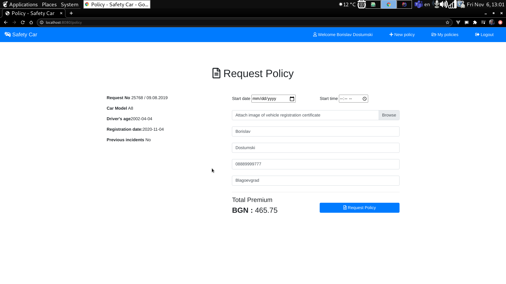

# Safety Car Insurance application for Web & REST

## Project Description

**SAFETY CAR** is a WEB and REST application. It is insurance-oriented application for the end users. It allows simulation of amount and request insurance policies online. The application functionalities are related to three different type of users: public and private, insurance agents and administrators.

**CAR SAFE** is a Mobile application for Android that consumes the REST API, and was also developed for the project.

<a href="https://gitlab.com/dimilkin/carsafeandroidproject">CAR SAFE Android App</a>

## Table of Content

- [General Info](#general-info)
- [Screenshots](#creenshots)
- [Features](#features)
- [Technical information](#technical-information)

## General Info

The **public part** of application is visible without authentication. It provides the following functionalities:

  - Simulate of car insurance offer based on some input criteria
  - Creation of new account and log-in functionality

The **private part** of application is for registered users only and is accessible after successful login. The main functionalities provided for this area are:

  - Send request for approval of offer (request policy)
  - List history of user’s requests

The **agents part** of the system should have permission to manage all user insurances in thes system. The main functionalities provided for this area are:

  - List of requests created in the system
  - Approval or rejection of the requests

The **administrator part** of the system should have permission to manage all major information objects in thes system. The main functionalities provided for this area are:

  - Register new insurance agents in the application
  - Give or reject access to the application for any of the registered users and agents.

## Screenshots
<table>
<tr>
<td></td>
<td></td>
</tr>
<tr>
<td></td>
<td></td>
</tr>
<tr>
<td></td>
<td></td>
</tr>
<tr>
<td></td>
<td></td>
</table>

## Business Glossary
<table style="width:100%;">
<tr><th>Term</th><th>Description</th></tr>
<tr><td>Offer (Quote)</td><td>An estimate of expected value of insurance policy</td></tr>
<tr><td>Insurance Policy</td><td>A legal contract between insurer and insured person</td></tr>
<tr><td>Net premium</td><td>The amount of insurance policy to be paid by the client before taxes</td></tr>
<tr><td>Total Premium</td><td>The final amount of insurance policy to be paid by the client after taxes</td></tr>
</table>

## Features
In the following sections different functionalities will be described in more details.

### Create Account
This functionality is accessible only from **public part** of the application.

A user can register in the system. The minimal data to be entered are a valid email address and password.

### Completion of registration via email confirmation link
 After a successful registration, an email is sent to the user for account confirmation.

### Simulate Offer
This functionality is accessible from **public and private part**.
There is a separate page – **simulation form**, where a user should input specific parameters for their car and visualize the amount of expected total premium.

The simulation form contains these business inputs:

  - car (brand and model)
  - cubic capacity
  - first registration date
  - driver age
  - accidents in previous year (yes/no)

After click on simulate button, the expected premium is calculated and shown on the screen.

The calculation of premium amount (**totalPremium**), is based on the following rules:

**totalPremium = netPremium + taxAmount**, where:

  - netPremium = baseAmount * accidentCoeff * driverAgeCoeff
  - taxAmount = 10% of netPremium

The calculation of net premium (**netPremium**) is based on the following parameters:

  - **baseAmount** - amount which is calculated depending on two criteria from input form: cubic capacity and first registration date. Both input criteria parameters are range based (see details below)
  - **accidentCoeff** – increase amount with 20% if there is an accident in previous year. The answer of form input parameter to be used.
  - **driverAgeCoeff** - increase amount with 5% if driver is under 25 years old

For the calculation of the base amount the following values in the multicriteria range table apply:

Example: cubic capacity = 1400, car age = 10 => base amount = 690.96.

When the total premium amount is calculated, the user has the possibility to request this offer for approval. If the user has not been logged in, the system is requiring force him/her to log in. If the user is logged,
he/she is automatically redirected to the page for policy request preparation.
Business controls to check data validity are implemented in js, such as:
 * the driver can't be younger than 18 years.
 * The registration date of the car can't be in a future moment.

### Request policy
This functionality is accessible only from **private part** of the application.

In order to issue a final policy, additional details are needed. The user is redirected to a new page to gather the following information:
  - effective date of the policy
  - attachment of image of vehicle registration certificate
  - communication details: email, phone, postal address

All details from the simulated offer are visible in this page, where the final policy is being requested.
Once the policy is requested it is in the system for further management. At this stage the request becomes in state “pending” and should be treated by the administrators of the system.
Business controls to check data validity are implemented in js, such as:
 * The policy can't be requested with past date and time regarding the time of the request.
 * An image must be uploaded for the policy to be requested successfully.

### User’s Request History
This functionality is accessible only from **private part** of the application.
A page displays a list of all policy requests for the logged user with their details. The history of all requests is shown (pending, approved and rejected) and chronologically sorted.
The user can cancel requests which are pending (not treated by insurace agents). If that happens the insurance agent can't change the policy status.

### Manage Requests
This functionality is accessible only from **insurance agent part** of the application.
A page displays a list of all pending requests in the system with their details. The insurace agent is able to accept or reject the request.
The insurance agent can filter requests by different criteria (user, request date, etc.)

## Technical information:

### This general guidelines were followed during development:

  -  **OOP** principles when coding
  -  **KISS, SOLID, DRY** principles when coding
  -  **REST API** design best practices when designing the REST API.

### Database
The data of the application is stored in a relational database – **MariaDB**.

### Backend

  - **JDK version 11**
  - **SpringMVC** and **SpringBoot** framework
  - **Hibernate** in the persistence (repository) layer
  - **Spring Security** to handle user authentication

### Frontend

  - **Spring MVC Framework with Thymeleaf template engine** for generating the UI
  - AJAX for making asynchronous requests to the server between Car Brand and Car Model
  - Bootstrap

### Deliverables

  - <a href="https://gitlab.com/b.dostumski/insurance"> Git</a>  
  - <a href="https://trello.com/b/1n3wCQk4/carsafe"> Trello board</a>
  - <a href="https://www.youtube.com/watch?v=mUGKc6mLlOw&t=374s">Video</a>

## Team
<table>
<tr>
<th>Dimitar Milkin</th>
<th>Borislav Dostumski</th>
</tr>
<td></td>
<td></td>
</table>
