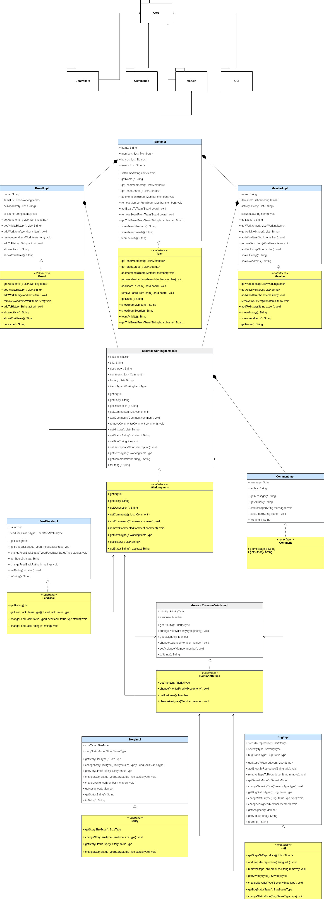
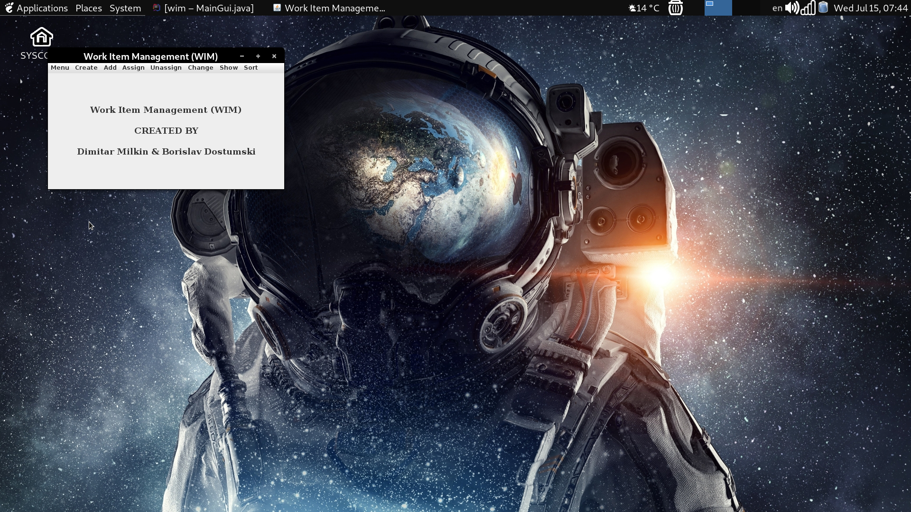
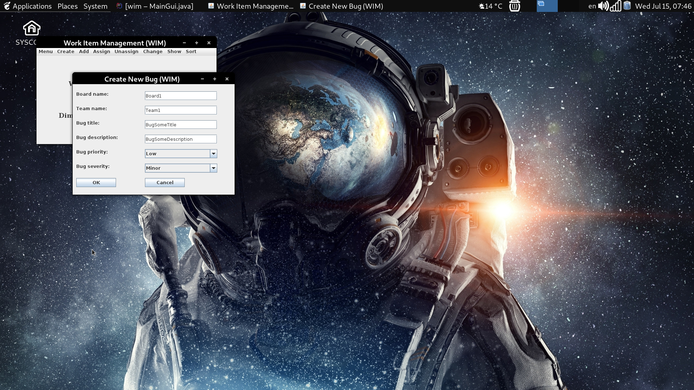
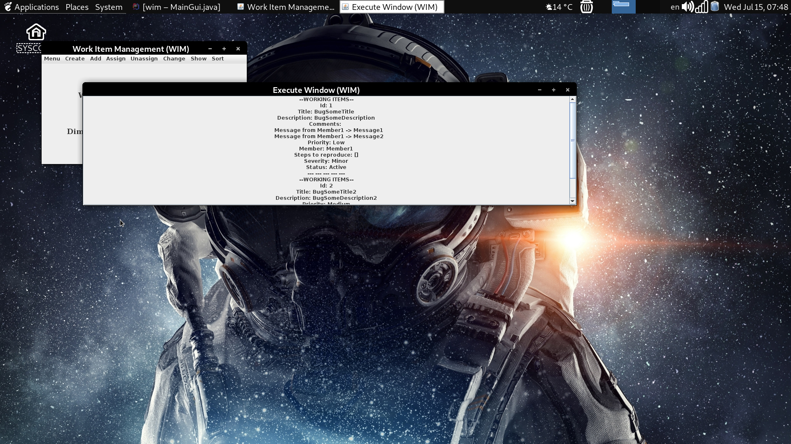

# Work Item Management (WIM) Console & Graphical User Interface Application

### Project Description
Design and implement a **Work Item Management (WIM)** Console & Graphical User Interface Application.

### Project Language Level SDK Java version 11.0.7
  - #### JUnit framework for unit tests
  - #### Swing API for Graphical User Interface
  - #### File I/O Stream

### Functional Requirements
Application should support multiple **teams**. Each team has **name**, **members** and **boards**.

Member has **name**, list of **work items** and **activity history**.
  - Name should be unique in the application
  - Name is a string between 5 and 15 symbols.

Board has **name**, list of **work items** and **activity history**.
  - Name should be unique in the team
  - Name is a string between 5 and 10 symbols.

There are 3 types of work items: **bug**, **story** and **feedback**.

### Bug
Bug has ID, title, description, steps to reproduce, priority, severity, status, assignee, comments and history.
  - Title is a string between 10 and 50 symbols.
  - Description is a string between 10 and 500 symbols.
  - Steps to reproduce is a list of strings.
  - Priority is one of the following: High, Medium, Low
  - Severity is one of the following: Critical, Major, Minor
  - Status is one of the following: Active, Fixed
  - Assignee is a member from the team.
  - Comments is a list of comments (string messages with author).
  - History is a list of all changes (string messages) that were done to the bug.

### Story
Story has ID, title, description, priority, size, status, assignee, comments and history.
  - Title is a string between 10 and 50 symbols.
  - Description is a string between 10 and 500 symbols.
  - Priority is one of the following: High, Medium, Low
  - Size is one of the following: Large, Medium, Small
  - Status is one of the following: NotDone, InProgress, Done
  - Assignee is a member from the team.
  - Comments is a list of comments (string messages with author).
  - History is a list of all changes (string messages) that were done to the story.

### Feedback
Feedback has ID, title, description, rating, status, comments and history.
  - Title is a string between 10 and 50 symbols.
  - Description is a string between 10 and 500 symbols.
  - Rating is an integer.
  - Status is one of the following: New, Unscheduled, Scheduled, Done
  - Comments is a list of comments (string messages with author).
  - History is a list of all changes (string messages) that were done to the feedback.

**Note: IDs of work items should be unique in the application i.e. if we have a bug with ID X then we can't have Story of Feedback with ID X.**

### Operations
Application should support the following operations:
  - Create a new person
  - Show all people
  - Show person's activity
  - Create a new team
  - Show all teams
  - Show team's activity
  - Add person to team
  - Show all team members
  - Create a new board in a team
  - Show all team boards
  - Show board's activity
  - Create a new Bug/Story/Feedback in a board
  - Change Priority/Severity/Status of a bug
  - Change Priority/Size/Status of a story
  - Change Rating/Status of a feedback
  - Assign/Unassign work item to a person
  - Add comment to a work item
  - List work items with options:
    - List all
    - Filter bugs/stories/feedback only
    - Filter by status and/or asignee
    - Sort by title/priority/severity/size/rating

### Commands
#### CREATE
  - CREATETEAMMEMBER `[MemberName]`
  - CREATETEAM `[TeamName]`
  - CREATENEWBOARD `[BoardName]` `[TeamName]`
  - CREATEBUG `[TeamName]` `[BoardName]` `[BugTitle 10 - 50]` `[BugDescription 10-500]` `[BugPriority HIGH, MEDIUM, LOW]` `[SeverityBug CRITICAL, MAJOR, MINOR]`
  - CREATEFEEDBACK `[TeamName]` `[BoardName]` `[FeedBackTitle 10 - 50]` `[FeedBackDescription 10 - 500]` `[FeedBackRating 1-5]`
  - CREATESTORY `[TeamName]` `[BoardName]` `[StoryTitle 10 - 50]` `[StoryDescripiton 10 - 500]` `[StoryPriority HIGH, MEDIUM, LOW]` `[StorySize LARGE, MEDIUM, SMALL]`

#### ADD

  - ADDCOMMENTTOWORKITEM `[WorkingItemId]` `[Message]` `[Author]`

#### ASSIGN

  - ASSIGNMEMBERTOTEAM `[TeamName]` `[MemberName]`
  - ASSIGNWORKTOMEMBER `[MemberName]` `[WorkingItemId]`

#### UNASSIGN
  - UNASSIGNWORKTOMEMBER `[MemberName]` `[WorkingItemId]`

#### CHANGE
  - CHANGEBUGPRIORITY `[BugId]` `[NewPriority HIGH, MEDIUM, LOW]`
  - CHANGEBUGSEVERITY `[BugId]` `[NewSeverity CRITICAL, MAJOR, MINOR]`
  - CHANGEBUGSTATUS `[BugId]` `[NewStatus ACTIVE, FIXED]`
  - CHANGEFEEDBACKRATING `[FeedBackId]` `[NewRating 1 - 5]`
  - CHANGEFEEDBACKSTATUS `[FeedBackId]` `[NewFeedBackStatus NEW, UNSCHEDULED, SCHEDULED, DONE]`
  - CHANGESTORYPRIORITY `[SotryId]` `[NewPriority HIGH, MEDIUM, LOW]`
  - CHANGESTORYSIZE `[StoryId]` `[NewSize LARGE, MEDIUM, SMALL]`
  - CHANGESTORYSTATUS `[StatusId]` `[NewStatus NOTDONE, INPROGRESS, DONE]`

#### SHOW
  - SHOWALLMEMBERS
  - SHOWALLTEAMS
  - LISTALLWORKITEMS
  - LISTBUGSONLY
  - LISTFEEDBACKSONLY
  - LISTSTORIESONLY
  - SHOWTEAMSBOARDS `[TeamName]`
  - SHOWBOARDACTIVITY `[TeamName]` `[BoardName]`
  - SHOWMEMBERACTIVITY `[MemberName]`
  - SHOWTEAMACTIVITY `[TeamName]`

#### SORT
  - SORTBYSEVERITY
  - SORTBYPRIORITY
  - SORTBYRATING
  - SORTBYTITLE
  - SORTBYSIZE

  ### Work Item Management (WIM) UML Diagram
  

### INPUT EXAMPLE
    CREATETEAMMEMBER Member1
    CREATETEAMMEMBER Member2
    SHOWALLMEMBERS
    CREATETEAM Team1
    CREATETEAM Team2
    SHOWALLTEAMS
    CREATENEWBOARD Board1 Team1
    CREATENEWBOARD Board2 Team2
    SHOWTEAMSBOARDS Team1
    SHOWTEAMSBOARDS Team2
    ASSIGNMEMBERTOTEAM Team1 Member1
    ASSIGNMEMBERTOTEAM Team2 Member2
    CREATEBUG Team1 Board1 BugTitleBetween-10-50-Signs BugDescriptionBetween-10-500-Signs HIGH CRITICAL
    CREATEBUG Team2 Board2 NewBugTitleBetween-10-50-Signs NewBugDescriptionBetween-10-500-Signs HIGH CRITICAL
    LISTBUGSONLY
    CHANGEBUGPRIORITY 1 MEDIUM
    CHANGEBUGSEVERITY 1 MAJOR
    CHANGEBUGSTATUS 1 FIXED
    LISTBUGSONLY
    CREATEFEEDBACK Team1 Board1 FeedBackTitleBetween-10-50-Signs FeedBackDescriptionBetween-10-500-Signs 1
    CREATEFEEDBACK Team2 Board2 NewFeedBackTitleBetween-10-50-Signs NewFeedBackDescriptionBetween-10-500-Signs 1
    LISTFEEDBACKSONLY
    CHANGEFEEDBACKRATING 3 5
    CHANGEFEEDBACKSTATUS 3 DONE
    LISTFEEDBACKSONLY
    CREATESTORY Team1 Board1 StoryTitleBetween-10-50-Signs StoryDescripitonBetween-10-500-Signs HIGH LARGE
    CREATESTORY Team2 Board2 NewStoryTitleBetween-10-50-Signs NewStoryDescripitonBetween-10-500-Signs HIGH LARGE
    LISTSTORIESONLY
    CHANGESTORYPRIORITY 5 LOW
    CHANGESTORYSIZE 5 SMALL
    CHANGESTORYSTATUS 5 INPROGRESS
    LISTSTORIESONLY
    ADDCOMMENTTOWORKITEM 1 Message1 Author1
    ADDCOMMENTTOWORKITEM 1 Message2 Author2
    ADDCOMMENTTOWORKITEM 2 Message4 Author4
    ADDCOMMENTTOWORKITEM 3 Message5 Author5
    ASSIGNWORKTOMEMBER Member1 1
    ASSIGNWORKTOMEMBER Member2 2
    UNASSIGNWORKTOMEMBER Member1 1
    UNASSIGNWORKTOMEMBER Member2 2
    ASSIGNWORKTOMEMBER Member1 1
    SHOWMEMBERACTIVITY Member1
    SHOWMEMBERACTIVITY Member2
    SHOWTEAMACTIVITY Team1
    SHOWTEAMACTIVITY Team2
    SHOWBOARDACTIVITY Team1 Board1
    SHOWBOARDACTIVITY Team2 Board2
    LISTALLWORKITEMS
    SORTBYSEVERITY
    SORTBYPRIORITY
    SORTBYRATING
    SORTBYTITLE
    SORTBYSIZE
    EXIT

### OUTPUT EXAMPLE
    >------------------------------------<
    Member successfully added!
    >------------------------------------<
    Member successfully added!
    >------------------------------------<
    Member1
    --- --- --- --- ---
    Member2
    >------------------------------------<
    Team successfully created!
    >------------------------------------<
    Team successfully created!
    >------------------------------------<
    Team1
    --- --- --- --- ---
    Team2
    >------------------------------------<
    successfully added board to team
    >------------------------------------<
    successfully added board to team
    >------------------------------------<
    Team Boards
    For team: Team1
    1. Team Board: Board1

    >------------------------------------<
    Team Boards
    For team: Team2
    1. Team Board: Board2

    >------------------------------------<
    successfully added member to team
    >------------------------------------<
    successfully added member to team
    >------------------------------------<
    Successfully added bug inquiry to board
    >------------------------------------<
    Successfully added bug inquiry to board
    >------------------------------------<
    --WORKING ITEMS--
    Id: 1
    Title: BugTitleBetween-10-50-Signs
    Description: BugDescriptionBetween-10-500-Signs
    Priority: High
    Member: No Member
    Steps to reproduce: []
    Severity: Critical
    Status: Active

    --- --- --- --- ---
    --WORKING ITEMS--
    Id: 2
    Title: NewBugTitleBetween-10-50-Signs
    Description: NewBugDescriptionBetween-10-500-Signs
    Priority: High
    Member: No Member
    Steps to reproduce: []
    Severity: Critical
    Status: Active
    >------------------------------------<
    Bug priority updated successfully
    >------------------------------------<
    Bug Severity updated successfully
    >------------------------------------<
    Bug status updated successfully
    >------------------------------------<
    --WORKING ITEMS--
    Id: 1
    Title: BugTitleBetween-10-50-Signs
    Description: BugDescriptionBetween-10-500-Signs
    Priority: Medium
    Member: No Member
    Steps to reproduce: []
    Severity: Major
    Status: Fixed

    --- --- --- --- ---
    --WORKING ITEMS--
    Id: 2
    Title: NewBugTitleBetween-10-50-Signs
    Description: NewBugDescriptionBetween-10-500-Signs
    Priority: High
    Member: No Member
    Steps to reproduce: []
    Severity: Critical
    Status: Active
    >------------------------------------<
    Successfully created feed back inquiry to board
    >------------------------------------<
    Successfully created feed back inquiry to board
    >------------------------------------<
    --WORKING ITEMS--
    Id: 3
    Title: FeedBackTitleBetween-10-50-Signs
    Description: FeedBackDescriptionBetween-10-500-Signs
    Rating: 1
    Status: New

    --- --- --- --- ---
    --WORKING ITEMS--
    Id: 4
    Title: NewFeedBackTitleBetween-10-50-Signs
    Description: NewFeedBackDescriptionBetween-10-500-Signs
    Rating: 1
    Status: New
    >------------------------------------<
    Feedback rating changed successfully
    >------------------------------------<
    Feedback status changed successfully
    >------------------------------------<
    --WORKING ITEMS--
    Id: 3
    Title: FeedBackTitleBetween-10-50-Signs
    Description: FeedBackDescriptionBetween-10-500-Signs
    Rating: 5
    Status: Done

    --- --- --- --- ---
    --WORKING ITEMS--
    Id: 4
    Title: NewFeedBackTitleBetween-10-50-Signs
    Description: NewFeedBackDescriptionBetween-10-500-Signs
    Rating: 1
    Status: New
    >------------------------------------<
    Successfully created story inquiry to board
    >------------------------------------<
    Successfully created story inquiry to board
    >------------------------------------<
    --WORKING ITEMS--
    Id: 5
    Title: StoryTitleBetween-10-50-Signs
    Description: StoryDescripitonBetween-10-500-Signs
    Priority: High
    Member: No Member
    Size: Large
    Status: NotDone

    --- --- --- --- ---
    --WORKING ITEMS--
    Id: 6
    Title: NewStoryTitleBetween-10-50-Signs
    Description: NewStoryDescripitonBetween-10-500-Signs
    Priority: High
    Member: No Member
    Size: Large
    Status: NotDone
    >------------------------------------<
    Story priority changed successfully
    >------------------------------------<
    Story Size changed successfully
    >------------------------------------<
    Story Status changed successfully
    >------------------------------------<
    --WORKING ITEMS--
    Id: 5
    Title: StoryTitleBetween-10-50-Signs
    Description: StoryDescripitonBetween-10-500-Signs
    Priority: Low
    Member: No Member
    Size: Small
    Status: InProgress

    --- --- --- --- ---
    --WORKING ITEMS--
    Id: 6
    Title: NewStoryTitleBetween-10-50-Signs
    Description: NewStoryDescripitonBetween-10-500-Signs
    Priority: High
    Member: No Member
    Size: Large
    Status: NotDone
    >------------------------------------<
    successfully added comment to work item
    >------------------------------------<
    successfully added comment to work item
    >------------------------------------<
    successfully added comment to work item
    >------------------------------------<
    successfully added comment to work item
    >------------------------------------<
    successfully added member to team
    >------------------------------------<
    successfully added member to team
    >------------------------------------<
    successfully un-assign working item to member
    >------------------------------------<
    successfully un-assign working item to member
    >------------------------------------<
    successfully added member to team
    >------------------------------------<
    Hitory For member: Member1
    1. Added: BugTitleBetween-10-50-Signs
    2. Removed: BugTitleBetween-10-50-Signs
    3. Added: BugTitleBetween-10-50-Signs

    >------------------------------------<
    Hitory For member: Member2
    1. Added: NewBugTitleBetween-10-50-Signs
    2. Removed: NewBugTitleBetween-10-50-Signs

    >------------------------------------<
    Team Activity
    Team: Team1 has been doing :
    1. Added board Board1 to the team Team1.
    2. Added member Member1 to the team Team1.

    >------------------------------------<
    Team Activity
    Team: Team2 has been doing :
    1. Added board Board2 to the team Team2.
    2. Added member Member2 to the team Team2.

    >------------------------------------<
    History For board: Board1
    1. Added: BugTitleBetween-10-50-Signs
    2. Added: FeedBackTitleBetween-10-50-Signs
    3. Added: StoryTitleBetween-10-50-Signs

    >------------------------------------<
    History For board: Board2
    1. Added: NewBugTitleBetween-10-50-Signs
    2. Added: NewFeedBackTitleBetween-10-50-Signs
    3. Added: NewStoryTitleBetween-10-50-Signs

    >------------------------------------<
    --WORKING ITEMS--
    Id: 1
    Title: BugTitleBetween-10-50-Signs
    Description: BugDescriptionBetween-10-500-Signs
    Comments:
       Message from Author1 -> Message1
       Message from Author2 -> Message2
    Priority: Medium
    Member: Member1
    Steps to reproduce: []
    Severity: Major
    Status: Fixed

    --- --- --- --- ---
    --WORKING ITEMS--
    Id: 2
    Title: NewBugTitleBetween-10-50-Signs
    Description: NewBugDescriptionBetween-10-500-Signs
    Comments:
       Message from Author4 -> Message4
    Priority: High
    Member: No Member
    Steps to reproduce: []
    Severity: Critical
    Status: Active

    --- --- --- --- ---
    --WORKING ITEMS--
    Id: 3
    Title: FeedBackTitleBetween-10-50-Signs
    Description: FeedBackDescriptionBetween-10-500-Signs
    Comments:
       Message from Author5 -> Message5
    Rating: 5
    Status: Done

    --- --- --- --- ---
    --WORKING ITEMS--
    Id: 4
    Title: NewFeedBackTitleBetween-10-50-Signs
    Description: NewFeedBackDescriptionBetween-10-500-Signs
    Rating: 1
    Status: New

    --- --- --- --- ---
    --WORKING ITEMS--
    Id: 5
    Title: StoryTitleBetween-10-50-Signs
    Description: StoryDescripitonBetween-10-500-Signs
    Priority: Low
    Member: No Member
    Size: Small
    Status: InProgress

    --- --- --- --- ---
    --WORKING ITEMS--
    Id: 6
    Title: NewStoryTitleBetween-10-50-Signs
    Description: NewStoryDescripitonBetween-10-500-Signs
    Priority: High
    Member: No Member
    Size: Large
    Status: NotDone
    >------------------------------------<
    --WORKING ITEMS--
    Id: 2
    Title: NewBugTitleBetween-10-50-Signs
    Description: NewBugDescriptionBetween-10-500-Signs
    Comments:
       Message from Author4 -> Message4
    Priority: High
    Member: No Member
    Steps to reproduce: []
    Severity: Critical
    Status: Active

    --- --- --- --- ---
    --WORKING ITEMS--
    Id: 1
    Title: BugTitleBetween-10-50-Signs
    Description: BugDescriptionBetween-10-500-Signs
    Comments:
       Message from Author1 -> Message1
       Message from Author2 -> Message2
    Priority: Medium
    Member: Member1
    Steps to reproduce: []
    Severity: Major
    Status: Fixed
    >------------------------------------<
    --WORKING ITEMS--
    Id: 2
    Title: NewBugTitleBetween-10-50-Signs
    Description: NewBugDescriptionBetween-10-500-Signs
    Comments:
       Message from Author4 -> Message4
    Priority: High
    Member: No Member
    Steps to reproduce: []
    Severity: Critical
    Status: Active

    --- --- --- --- ---
    --WORKING ITEMS--
    Id: 6
    Title: NewStoryTitleBetween-10-50-Signs
    Description: NewStoryDescripitonBetween-10-500-Signs
    Priority: High
    Member: No Member
    Size: Large
    Status: NotDone

    --- --- --- --- ---
    --WORKING ITEMS--
    Id: 1
    Title: BugTitleBetween-10-50-Signs
    Description: BugDescriptionBetween-10-500-Signs
    Comments:
       Message from Author1 -> Message1
       Message from Author2 -> Message2
    Priority: Medium
    Member: Member1
    Steps to reproduce: []
    Severity: Major
    Status: Fixed

    --- --- --- --- ---
    --WORKING ITEMS--
    Id: 5
    Title: StoryTitleBetween-10-50-Signs
    Description: StoryDescripitonBetween-10-500-Signs
    Priority: Low
    Member: No Member
    Size: Small
    Status: InProgress
    >------------------------------------<
    --WORKING ITEMS--
    Id: 3
    Title: FeedBackTitleBetween-10-50-Signs
    Description: FeedBackDescriptionBetween-10-500-Signs
    Comments:
       Message from Author5 -> Message5
    Rating: 5
    Status: Done

    --- --- --- --- ---
    --WORKING ITEMS--
    Id: 4
    Title: NewFeedBackTitleBetween-10-50-Signs
    Description: NewFeedBackDescriptionBetween-10-500-Signs
    Rating: 1
    Status: New
    >------------------------------------<
    --WORKING ITEMS--
    Id: 1
    Title: BugTitleBetween-10-50-Signs
    Description: BugDescriptionBetween-10-500-Signs
    Comments:
       Message from Author1 -> Message1
       Message from Author2 -> Message2
    Priority: Medium
    Member: Member1
    Steps to reproduce: []
    Severity: Major
    Status: Fixed

    --- --- --- --- ---
    --WORKING ITEMS--
    Id: 3
    Title: FeedBackTitleBetween-10-50-Signs
    Description: FeedBackDescriptionBetween-10-500-Signs
    Comments:
       Message from Author5 -> Message5
    Rating: 5
    Status: Done

    --- --- --- --- ---
    --WORKING ITEMS--
    Id: 2
    Title: NewBugTitleBetween-10-50-Signs
    Description: NewBugDescriptionBetween-10-500-Signs
    Comments:
       Message from Author4 -> Message4
    Priority: High
    Member: No Member
    Steps to reproduce: []
    Severity: Critical
    Status: Active

    --- --- --- --- ---
    --WORKING ITEMS--
    Id: 4
    Title: NewFeedBackTitleBetween-10-50-Signs
    Description: NewFeedBackDescriptionBetween-10-500-Signs
    Rating: 1
    Status: New

    --- --- --- --- ---
    --WORKING ITEMS--
    Id: 6
    Title: NewStoryTitleBetween-10-50-Signs
    Description: NewStoryDescripitonBetween-10-500-Signs
    Priority: High
    Member: No Member
    Size: Large
    Status: NotDone

    --- --- --- --- ---
    --WORKING ITEMS--
    Id: 5
    Title: StoryTitleBetween-10-50-Signs
    Description: StoryDescripitonBetween-10-500-Signs
    Priority: Low
    Member: No Member
    Size: Small
    Status: InProgress
    >------------------------------------<
    --WORKING ITEMS--
    Id: 6
    Title: NewStoryTitleBetween-10-50-Signs
    Description: NewStoryDescripitonBetween-10-500-Signs
    Priority: High
    Member: No Member
    Size: Large
    Status: NotDone

    --- --- --- --- ---
    --WORKING ITEMS--
    Id: 5
    Title: StoryTitleBetween-10-50-Signs
    Description: StoryDescripitonBetween-10-500-Signs
    Priority: Low
    Member: No Member
    Size: Small
    Status: InProgress
    >------------------------------------<
    Saving Data...
    Data Saved!

### Graphical User Interface Screenshots
<table>
  <tr>
      <td></td>
      <td></td>
      <td></td>
  </tr>
</table>

### [TRELLO LINK](https://trello.com/b/j9etgK7f/work-item-management)

### TEAM
<table>
  <tr>
    <th style="text-align:center; width:50%;">DIMITAR MILKIN</th>
    <th style="text-align:center; width:50%;">BORISLAV DOSTUMSKI</th>
  </tr>
  <tr>
      <td style="width:50%;"></td>
      <td style="width:50%;"></td>
  </tr>
</table>
